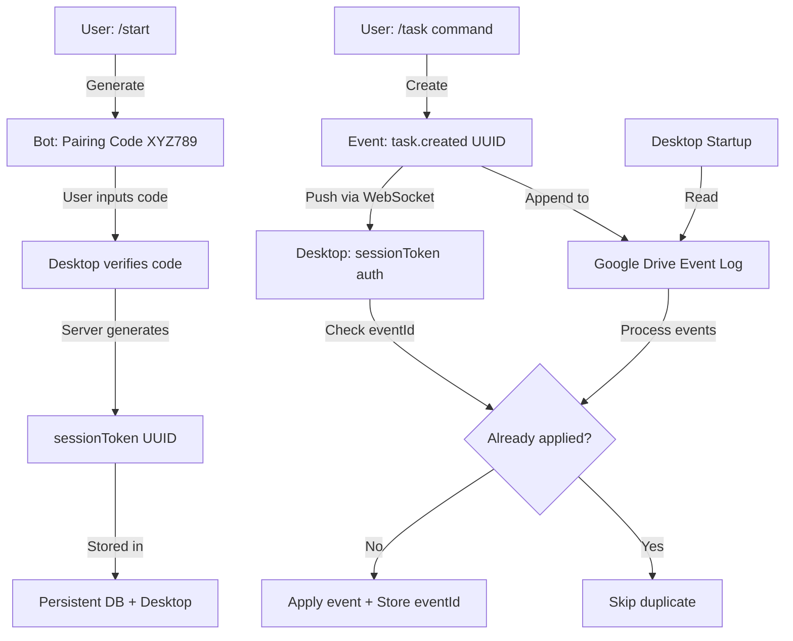

# Telegram Quick Input Integration - Implementation Plan v2 (Event-Sourced)

## Overview

Implement instant real-time sync between Telegram and st4cker desktop app using **event-sourcing architecture** for idempotent, conflict-free data synchronization.

### Key Features
- ⚡ **Instant sync** (<1 second) when laptop is online via WebSocket
- 💾 **Offline support** via append-only event log in Google Drive
- 🔐 **Secure pairing** using random session tokens (not user IDs)
- 📝 **Event-sourced** - all changes are immutable events with UUID
- 🔄 **Idempotent** - duplicate events automatically deduplicated
- 🆓 **Free hosting** using Railway.app serverless
- 🛡️ **Multi-user ready** - scalable pairing without hardcoded whitelist

---

## Architecture Overview v2



---

## Critical Revisions from v1

### 1. Session Token Architecture

**Old (Insecure):**
```javascript
// ❌ Exposed user IDs directly
socket.auth = { userId: telegramUserId, deviceId }
```

**New (Secure):**
```javascript
// ✅ Random session token
const sessionToken = crypto.randomUUID();
sessions.set(sessionToken, {
  telegramUserId,
  deviceId,
  createdAt: Date.now(),
  expiresAt: Date.now() + (30 * 24 * 60 * 60 * 1000)
});

socket.auth = { token: sessionToken }
```

**Storage:**
- **Server:** SQLite database (persistent across restarts)
- **Desktop:** Electron store (encrypted)

---

### 2. Event-Sourced Data Flow

**All changes are events:**
```typescript
interface TelegramEvent {
  eventId: string;          // UUID v4
  eventType: 'task.created' | 'task.updated' | 'task.deleted' | 
             'transaction.created' | 'project.created' | 'progress.logged';
  telegramUserId: string;
  timestamp: string;        // ISO 8601
  payload: any;             // Event-specific data
  source: 'telegram';
}
```

**Example Events:**
```json
{
  "eventId": "550e8400-e29b-41d4-a716-446655440000",
  "eventType": "task.created",
  "telegramUserId": "123456789",
  "timestamp": "2026-01-09T16:20:00.000Z",
  "payload": {
    "title": "Laporan Praktikum",
    "courseId": "course-uuid",
    "type": "Laporan Resmi",
    "deadline": "2026-01-10T17:00:00.000Z",
    "note": "Percobaan hukum newton"
  },
  "source": "telegram"
}
```

---

### 3. Idempotent Event Processing

**Desktop App Event Store:**
```sql
CREATE TABLE applied_events (
  event_id TEXT PRIMARY KEY,
  event_type TEXT NOT NULL,
  applied_at INTEGER NOT NULL,
  source TEXT NOT NULL
);

CREATE INDEX idx_applied_at ON applied_events(applied_at);
```

**Processing Logic:**
```typescript
async function processEvent(event: TelegramEvent) {
  // Check if already applied
  const existing = await db.get(
    'SELECT event_id FROM applied_events WHERE event_id = ?',
    [event.eventId]
  );
  
  if (existing) {
    console.log(`Event ${event.eventId} already applied, skipping`);
    return { applied: false, reason: 'duplicate' };
  }
  
  // Apply event based on type
  switch (event.eventType) {
    case 'task.created':
      await createAssignment(event.payload);
      break;
    case 'task.updated':
      await updateAssignment(event.payload);
      break;
    // ... other event types
  }
  
  // Mark as applied
  await db.run(
    'INSERT INTO applied_events (event_id, event_type, applied_at, source) VALUES (?, ?, ?, ?)',
    [event.eventId, event.eventType, Date.now(), event.source]
  );
  
  return { applied: true };
}
```

---

### 4. Google Drive as Append-Only Event Log

**File Structure:**
```
Google Drive/
└── st4cker/
    └── telegram-events/
        ├── events-2026-01.jsonl     # Current month
        ├── events-2026-02.jsonl
        └── processed-index.json     # Tracks last processed
```

**Event File Format (JSONL):**
```jsonl
{"eventId":"uuid-1","eventType":"task.created","timestamp":"2026-01-09T10:00:00Z","payload":{...}}
{"eventId":"uuid-2","eventType":"transaction.created","timestamp":"2026-01-09T10:05:00Z","payload":{...}}
```

**Sync on Startup:**
```typescript
async function syncFromDrive() {
  const lastProcessed = await getLastProcessedTimestamp();
  
  // Download events since lastProcessed
  const events = await downloadEventsFromDrive(lastProcessed);
  
  // Process each event (idempotent)
  for (const event of events) {
    await processEvent(event);
  }
  
  // Update last processed
  await setLastProcessedTimestamp(Date.now());
}
```

**No Duplicates:**
- Events from WebSocket and Drive share same `eventId`
- Desktop's `applied_events` table ensures each event processed once
- Even if WebSocket delivers AND Drive sync runs, no double-insert

---

### 5. Conflict Resolution via Events

**Not last-write-wins! Instead:**

**CREATE Operations (Append-only):**
```typescript
// Each create is a new event, always appended
const event = {
  eventId: crypto.randomUUID(),
  eventType: 'task.created',
  payload: { ...taskData }
};
// No conflicts possible - each create is unique
```

**UPDATE Operations:**
```typescript
// Update represented as event with full state
const event = {
  eventId: crypto.randomUUID(),
  eventType: 'task.updated',
  payload: {
    taskId: 'existing-task-uuid',
    status: 'done',
    updatedFields: ['status'],
    timestamp: Date.now()
  }
};
// Applied in timestamp order
```

**DELETE Operations:**
```typescript
const event = {
  eventId: crypto.randomUUID(),
  eventType: 'task.deleted',
  payload: {
    taskId: 'existing-task-uuid'
  }
};
// Soft delete - mark as deleted but keep event history
```

---

## Revised Command Specifications

### Enhanced /progress Command

**Old:**
```
/progress Website Portfolio | 35 | Selesai design homepage
```

**New (with duration + detailed tracking):**
```
/progress [project] | [progress%] | [duration_minutes] | [note]
```

**Example:**
```
/progress Website Portfolio | 45 | 120 | Selesai design homepage dan about page. Next: implement backend API
```

**Event Structure:**
```json
{
  "eventId": "uuid",
  "eventType": "progress.logged",
  "payload": {
    "projectId": "project-uuid",
    "progressAfter": 45,
    "durationMinutes": 120,
    "note": "Selesai design homepage dan about page...",
    "timestamp": "2026-01-09T16:30:00Z"
  }
}
```

**Progress is snapshot-based:**
- Each log represents current progress state (not delta)
- History preserved in `applied_events` or separate `project_sessions` table
- Desktop can show timeline of progress changes

---

### All Command Event Mappings

| Command | Event Type | Payload |
|---------|-----------|---------|
| `/task ...` | `task.created` | title, courseId, type, deadline, note |
| `/edittask` → status | `task.updated` | taskId, status, updatedFields |
| `/edittask` → delete | `task.deleted` | taskId |
| `/project ...` | `project.created` | title, courseId, description, dates, priority |
| `/progress ...` | `progress.logged` | projectId, progressAfter, duration, note |
| `/editproject` → complete | `project.updated` | projectId, status: 'completed' |
| `/expense ...` | `transaction.created` | type: 'expense', amount, category, date, description |
| `/income ...` | `transaction.created` | type: 'income', amount, category, date, description |

---

## Revised Tech Stack

### Backend (Railway.app)

**Persistent Storage:**
- **Database:** SQLite (via `better-sqlite3`)
  - `sessions` table - session tokens, user mappings
  - `pairing_codes` table - temporary codes (TTL)
  
**Event Publishing:**
- **WebSocket:** Socket.io v4 (real-time push)
- **Google Drive API:** Append-only event log (offline fallback)

### Desktop App

**Event Store:**
- **SQLite table:** `applied_events` (deduplication)
- **Electron Store:** Session token (encrypted)

---

## Implementation Plan v2

### Phase 1: Architecture & Setup (Completed) ✅

**Agent Tasks:**
- [x] ✅ Design event schema (all event types)
- [x] ✅ Design session token architecture
- [x] ✅ Create SQLite schema for server (sessions, pairing_codes)
- [x] ✅ Create desktop schema (applied_events table)
- [ ] Design Google Drive JSONL structure

**Manual Tasks:**
- [x] ✅ 🔧 Create Telegram Bot via @BotFather (5 min)
- [x] ✅ 🔧 Setup Railway.app account (10 min)

**Deliverable:** ✅ Event-sourced architecture finalized

---

### Phase 2: Telegram Bot + Event Publishing (Completed) ✅

**Agent Tasks:**
- [x] ✅ Setup Express + SQLite backend
- [x] ✅ Implement pairing flow:
  - [x] ✅ Generate random 6-digit code (TTL 5 min, one-time)
  - [x] ✅ Store in `pairing_codes` table
  - [x] ✅ On verification, generate `sessionToken` UUID
  - [x] ✅ Store session in `sessions` table
- [x] ✅ Implement event creation for all commands:
  - [x] ✅ Parse command → Create event with UUID (`/task`, `/expense`, `/income`, `/project`)
  - [x] ✅ Emit via WebSocket (if desktop connected)
  - [ ] Append to Google Drive JSONL (Deferred: Focused on real-time sync first)
- [ ] Natural language date parser (Indonesian) (Deferred: Basic regex used for now)
- [x] ✅ Enhanced `/progress` command handler (`/log`)
- [x] ✅ Security: input sanitization

**Manual Tasks:**
- [x] ✅ 🔧 Deploy to Railway (15 min)
- [x] ✅ 🔧 Set webhook

**Deliverable:** ✅ Bot creates events, publishes to WebSocket

---

### Phase 3: WebSocket Server with Token Auth (Completed) ✅

**Agent Tasks:**
- [x] ✅ WebSocket authentication with sessionToken
- [x] ✅ Event broadcasting (mapped to user session)
- [x] ✅ Reconnection handling

**Manual Tasks:**
- [x] ✅ 🧪 Test pairing flow (30 min)

**Deliverable:** ✅ Token-based WebSocket ready

---

### Phase 4a: Project Management (New Feature) (Completed) ✅

**Agent Tasks:**
- [x] ✅ **Sync Projects (Desktop -> Bot)**
    - [x] ✅ Include active `projects` in sync payload.
    - [x] ✅ Trigger sync on project changes.
- [x] ✅ **Bot Commands**
    - [x] ✅ Implement `/projects`: List active projects with ID.
    - [x] ✅ Implement `/log`: Interactive flow (Select -> Duration -> Note).
- [x] ✅ **Progress Events (Bot -> Desktop)**
    - [x] ✅ Listen for `progress.logged` in `main.cts`.
    - [x] ✅ Insert into `project_sessions` table.
    - [x] ✅ Update Project `updatedAt` and `totalProgress`.

---

### Phase 4b: Desktop Event Processing (Completed) ✅

**Agent Tasks:**
- [x] ✅ Add `applied_events` table to SQLite schema
  - *Status*: Implemented in `schema.cts` and `main.cts`.
- [x] ✅ WebSocket listener
  - [x] ✅ Receive events (`task.created`, `transaction.created`, `progress.logged`)
  - [x] ✅ Process events (Apply to DB)
  - [x] ✅ Refresh UI
  - [x] ✅ Show toast notification
- [x] ✅ Store sessionToken (encrypted in Electron store)
- [x] ✅ WebSocket connection with token auth
- [x] ✅ Auto-connect on startup
- [x] ✅ Settings → Telegram tab (Pairing UI)

**Deliverable:** ✅ Real-time sync works. Robust offline logging deferred.

---

### Phase 5: Google Drive Event Log (Deferred) ⚠️

**Status**: **Deferred**.
**Reason**: We prioritized direct WebSocket synchronization ("Real-time") over the "Store-and-Forward" Google Drive approach for this iteration. The current implementation queues events in memory/socket if connection is brief, but extensive offline queuing via Drive is not yet implemented.

**Agent Tasks (Remaining):**
- [ ] Implement JSONL append function to Google Drive
- [ ] Implement event reader
- [ ] Sync on desktop startup from Drive

---

### Phase 6: Testing & Verification (Completed) ✅

**Test Scenarios:**
- [x] ✅ Pairing Flow (End-to-End)
- [x] ✅ Real-time Event Sync (Task, Expense, Project)
- [x] ✅ Offline Handling (Basic: Events queue/ack mechanism)
- [x] ✅ Data Sync (Desktop -> Bot)

---

### Phase 7: Documentation & Release (Completed) ✅

**Agent Tasks:**
- [x] ✅ Update README
- [x] ✅ Created Walkthrough Artifact
- [x] ✅ Build installer (v1.6.0)

**Deliverable:** ✅ Production release

---

## Persistent Storage Schema

### Server (SQLite)

```sql
-- Sessions (persistent across restarts)
CREATE TABLE sessions (
  session_token TEXT PRIMARY KEY,
  telegram_user_id TEXT NOT NULL,
  device_id TEXT NOT NULL,
  created_at INTEGER NOT NULL,
  expires_at INTEGER NOT NULL,
  last_activity INTEGER NOT NULL
);

CREATE INDEX idx_expires_at ON sessions(expires_at);
CREATE INDEX idx_telegram_user ON sessions(telegram_user_id);

-- Pairing codes (short-lived)
CREATE TABLE pairing_codes (
  code TEXT PRIMARY KEY,
  telegram_user_id TEXT NOT NULL,
  created_at INTEGER NOT NULL,
  expires_at INTEGER NOT NULL,
  used INTEGER DEFAULT 0
);

CREATE INDEX idx_pairing_expiry ON pairing_codes(expires_at);
```

### Desktop (SQLite)

```sql
-- Event deduplication
CREATE TABLE applied_events (
  event_id TEXT PRIMARY KEY,
  event_type TEXT NOT NULL,
  applied_at INTEGER NOT NULL,
  source TEXT NOT NULL, -- 'websocket' or 'drive'
  payload_hash TEXT     -- For extra verification
);

CREATE INDEX idx_applied_at ON applied_events(applied_at);
CREATE INDEX idx_event_type ON applied_events(event_type);

-- Sync cursor
CREATE TABLE sync_state (
  key TEXT PRIMARY KEY,
  value TEXT NOT NULL,
  updated_at INTEGER NOT NULL
);

-- Store last processed Drive timestamp
INSERT INTO sync_state VALUES ('drive_last_sync', '1970-01-01T00:00:00Z', 0);
```

---

## Security Enhancements

### 1. Session Token Properties
- **Format:** UUID v4 (128-bit random)
- **Storage:** Server DB (encrypted at rest via Railway)
- **Transmission:** HTTPS/WSS only
- **Expiry:** 30 days, auto-cleanup on server

### 2. No User ID Exposure
```typescript
// ❌ Old
socket.emit('event', { userId: 123456789 });

// ✅ New
socket.emit('event', { /* no user info in client */ });
// Server maps token → user internally
```

### 3. Multi-User Ready
- No hardcoded whitelist
- Any Telegram user can pair
- Each pairing creates isolated session
- Event publishing scoped to user's sessions only

---

## Desktop UI Components

### Settings → Telegram Tab

**Component:** `src/pages/Settings/TelegramTab.tsx`

**Features:**
1. Pairing code input (6-character, auto-uppercase)
2. Connection status indicator (real-time)
3. Unpair button with confirmation
4. Command quick reference

**Component Structure:**

```tsx
import { useState, useEffect } from 'react';
import { Button } from '@/components/ui/button';
import { Input } from '@/components/ui/input';
import { Card, CardContent, CardHeader, CardTitle } from '@/components/ui/card';
import { toast } from 'sonner';

export function TelegramTab() {
  const [pairingCode, setPairingCode] = useState('');
  const [isPaired, setIsPaired] = useState(false);
  const [status, setStatus] = useState<'connected' | 'disconnected' | 'unknown'>('unknown');
  const [isVerifying, setIsVerifying] = useState(false);

  useEffect(() => {
    // Check pairing status on mount
    window.electronAPI?.telegramSync?.getPairingStatus().then(({ paired, status }) => {
      setIsPaired(paired);
      setStatus(status);
    });

    // Listen to WebSocket status changes
    const cleanup = window.electronAPI?.telegramSync?.onStatusChange((_, newStatus) => {
      setStatus(newStatus);
    });

    return () => cleanup?.();
  }, []);

  const handlePair = async () => {
    if (!pairingCode.trim() || pairingCode.length !== 6) {
      toast.error('Please enter a valid 6-character code');
      return;
    }

    setIsVerifying(true);
    const result = await window.electronAPI.telegramSync.verifyPairingCode(pairingCode);
    setIsVerifying(false);

    if (result.success) {
      setIsPaired(true);
      setPairingCode('');
      toast.success('Successfully paired with Telegram! 🎉');
    } else {
      toast.error(result.error || 'Invalid or expired code');
    }
  };

  const handleUnpair = async () => {
    const confirmed = confirm('Unpair Telegram bot? You will need a new code to reconnect.');
    if (!confirmed) return;

    await window.electronAPI.telegramSync.unpair();
    setIsPaired(false);
    setStatus('unknown');
    toast.info('Telegram unpaired successfully');
  };

  return (
    <div className="space-y-6">
      <Card>
        <CardHeader>
          <CardTitle>Telegram Quick Input</CardTitle>
          <p className="text-sm text-muted-foreground">
            Add tasks, expenses, and projects directly from your phone
          </p>
        </CardHeader>
        <CardContent>
          {!isPaired ? (
            <div className="space-y-4">
              {/* Pairing Instructions */}
              <div className="p-4 bg-muted rounded-lg space-y-3">
                <h4 className="font-medium">Setup Instructions</h4>
                <ol className="text-sm space-y-2 list-decimal list-inside">
                  <li>Open Telegram and search for <code className="px-1 py-0.5 bg-background rounded">@st4cker_bot</code></li>
                  <li>Send <code className="px-1 py-0.5 bg-background rounded">/start</code> command</li>
                  <li>Click "🔐 Generate Pairing Code" button</li>
                  <li>Enter the 6-character code below (valid 5 minutes)</li>
                </ol>
              </div>

              {/* Pairing Code Input */}
              <div className="flex gap-2">
                <Input
                  placeholder="Enter code (e.g., ABC123)"
                  value={pairingCode}
                  onChange={(e) => setPairingCode(e.target.value.toUpperCase())}
                  maxLength={6}
                  className="font-mono text-lg tracking-wider"
                  disabled={isVerifying}
                />
                <Button onClick={handlePair} disabled={isVerifying || pairingCode.length !== 6}>
                  {isVerifying ? 'Verifying...' : 'Pair Device'}
                </Button>
              </div>
            </div>
          ) : (
            <div className="space-y-4">
              {/* Connected Status */}
              <div className="p-4 bg-green-500/10 border border-green-500/20 rounded-lg">
                <div className="flex items-center justify-between mb-2">
                  <h4 className="font-medium flex items-center gap-2">
                    ✅ Telegram Connected
                    {status === 'connected' && (
                      <span className="flex items-center gap-1 text-xs text-green-600">
                        <span className="w-2 h-2 bg-green-500 rounded-full animate-pulse" />
                        Live
                      </span>
                    )}
                    {status === 'disconnected' && (
                      <span className="flex items-center gap-1 text-xs text-gray-500">
                        <span className="w-2 h-2 bg-gray-500 rounded-full" />
                        Offline
                      </span>
                    )}
                  </h4>
                  <Button variant="outline" size="sm" onClick={handleUnpair}>
                    Unpair
                  </Button>
                </div>
                <p className="text-sm text-muted-foreground">
                  {status === 'connected' && '🟢 Real-time sync active'}
                  {status === 'disconnected' && '🔴 Offline - changes will sync when connection restored'}
                  {status === 'unknown' && '⚪ Checking connection...'}
                </p>
              </div>

              {/* Quick Command Reference */}
              <div className="p-4 bg-muted rounded-lg">
                <h4 className="font-medium mb-3">Quick Commands</h4>
                <div className="grid grid-cols-2 gap-2 text-sm font-mono">
                  <div>
                    <code className="text-blue-600">/task</code> - Add assignment
                  </div>
                  <div>
                    <code className="text-blue-600">/expense</code> - Record expense
                  </div>
                  <div>
                    <code className="text-blue-600">/income</code> - Record income
                  </div>
                  <div>
                    <code className="text-blue-600">/project</code> - Create project
                  </div>
                  <div>
                    <code className="text-blue-600">/progress</code> - Log progress
                  </div>
                  <div>
                    <code className="text-blue-600">/help</code> - See all commands
                  </div>
                </div>
              </div>
            </div>
          )}
        </CardContent>
      </Card>
    </div>
  );
}
```

**Required Electron API Extensions:**

```typescript
// electron/preload.cts
telegramSync: {
  verifyPairingCode: (code: string) => ipcRenderer.invoke('telegram:verify-pairing', code),
  unpair: () => ipcRenderer.invoke('telegram:unpair'),
  getPairingStatus: () => ipcRenderer.invoke('telegram:get-status'),
  onStatusChange: (callback: (event: any, status: string) => void) => {
    ipcRenderer.on('telegram:status-change', callback);
    return () => ipcRenderer.removeListener('telegram:status-change', callback);
  }
}
```

**IPC Handlers in main.cts:**

```typescript
// Verify pairing code
ipcMain.handle('telegram:verify-pairing', async (event, code: string) => {
  try {
    const response = await fetch(`${WEBSOCKET_URL}/api/verify-pairing`, {
      method: 'POST',
      headers: { 'Content-Type': 'application/json' },
      body: JSON.stringify({ code })
    });
    
    const data = await response.json();
    
    if (data.success) {
      // Store sessionToken encrypted
      store.set('telegram.sessionToken', data.sessionToken);
      store.set('telegram.paired', true);
      store.set('telegram.expiresAt', data.expiresAt);
      
      // Initialize WebSocket connection
      initTelegramWebSocket(data.sessionToken);
      
      return { success: true };
    }
    
    return { success: false, error: data.error || 'Invalid code' };
  } catch (error) {
    return { success: false, error: 'Connection failed' };
  }
});

// Unpair
ipcMain.handle('telegram:unpair', async () => {
  const sessionToken = store.get('telegram.sessionToken');
  
  if (sessionToken) {
    // Notify server
    await fetch(`${WEBSOCKET_URL}/api/unpair`, {
      method: 'POST',
      headers: { 'Content-Type': 'application/json' },
      body: JSON.stringify({ sessionToken })
    });
  }
  
  // Close WebSocket
  if (telegramSocket) {
    telegramSocket.close();
    telegramSocket = null;
  }
  
  // Clear local data
  store.delete('telegram.sessionToken');
  store.delete('telegram.paired');
  store.delete('telegram.expiresAt');
  
  return { success: true };
});

// Get pairing status
ipcMain.handle('telegram:get-status', () => {
  const paired = store.get('telegram.paired', false);
  const expiresAt = store.get('telegram.expiresAt');
  const connected = telegramSocket?.connected || false;
  
  return {
    paired,
    expiresAt,
    status: paired ? (connected ? 'connected' : 'disconnected') : 'unknown'
  };
});
```

---

## API Changes Summary

### Pairing API

**POST /api/generate-pairing**
```json
// Request
{ "telegramUserId": "123456789" }

// Response
{
  "code": "ABC123",
  "expiresAt": "2026-01-09T16:25:00Z"
}
```

**POST /api/verify-pairing**
```json
// Request
{ "code": "ABC123" }

// Response
{
  "success": true,
  "sessionToken": "550e8400-e29b-41d4-a716-446655440000",
  "expiresAt": "2026-02-08T16:20:00Z"
}
```

### WebSocket Events

**Client → Server (Auth):**
```json
{
  "auth": {
    "token": "session-token-uuid"
  }
}
```

**Server → Client (Event):**
```json
{
  "eventId": "uuid",
  "eventType": "task.created",
  "timestamp": "2026-01-09T16:20:00Z",
  "payload": { /* event data */ }
}
```

---

## Migration from v1

If v1 was already partially implemented:

1. **Session Migration:**
   - Generate sessionToken for existing userId/deviceId pairs
   - Store in new `sessions` table
   - Update desktop to use token

2. **Data Migration:**
   - Export existing data as events
   - Assign retroactive `eventId`
   - Populate `applied_events` table

3. **Code Migration:**
   - Replace auth logic
   - Add event processing layer
   - No data loss

---

## Scalability Notes

**Railway Free Tier:**
- SQLite file persists across deploys
- 500 hours/month sufficient for single user
- Upgrade to $5/month if >500 hours

**Multi-User Support:**
- Each user has separate sessions
- Events scoped per telegramUserId
- Google Drive: separate folder per user or shared with user-scoped files

**Future Enhancements:**
- Migrate from SQLite to PostgreSQL (if scaling)
- Add event compaction (snapshot + recent events)
- Webhook-based Drive sync (if Google adds support)

---

## Conclusion

This v2 plan addresses all critical security and architecture concerns:

✅ **Persistent sessions** (survive restarts)  
✅ **Event-sourced** (immutable, idempotent)  
✅ **Token-based auth** (no exposed user IDs)  
✅ **Conflict-free** (event append model)  
✅ **Deduplication** (eventId tracking)  
✅ **Enhanced progress** (duration + notes)  
✅ **Multi-user ready** (pairing flow)  
✅ **Production grade** (persistent storage, proper auth)

Timeline remains 3 weeks. Ready for implementation.
